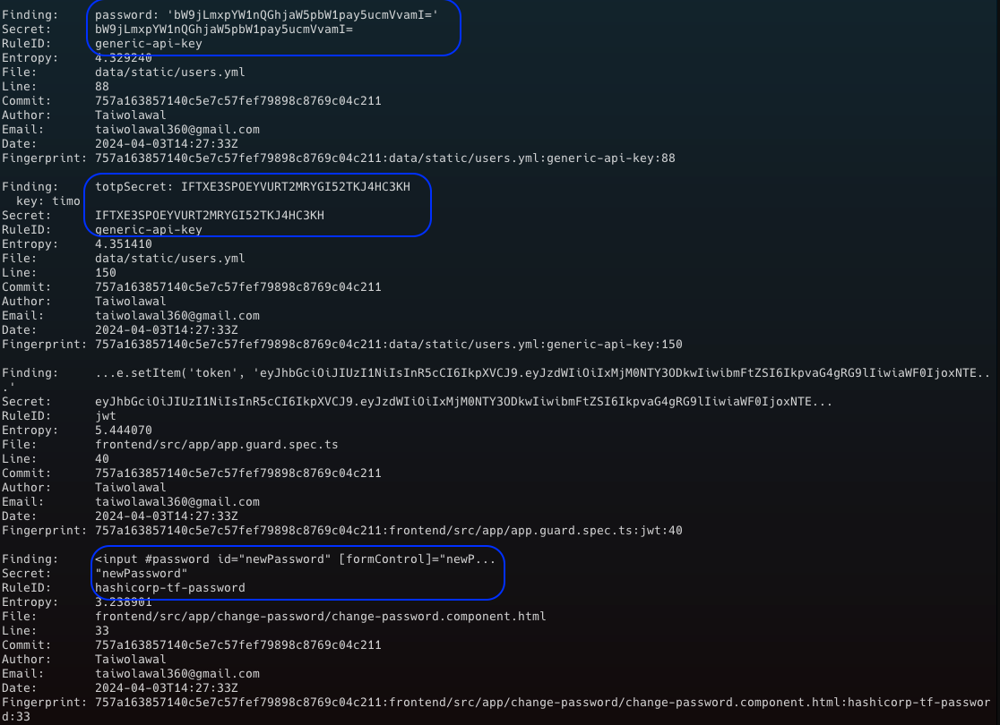
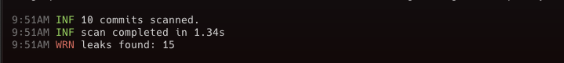
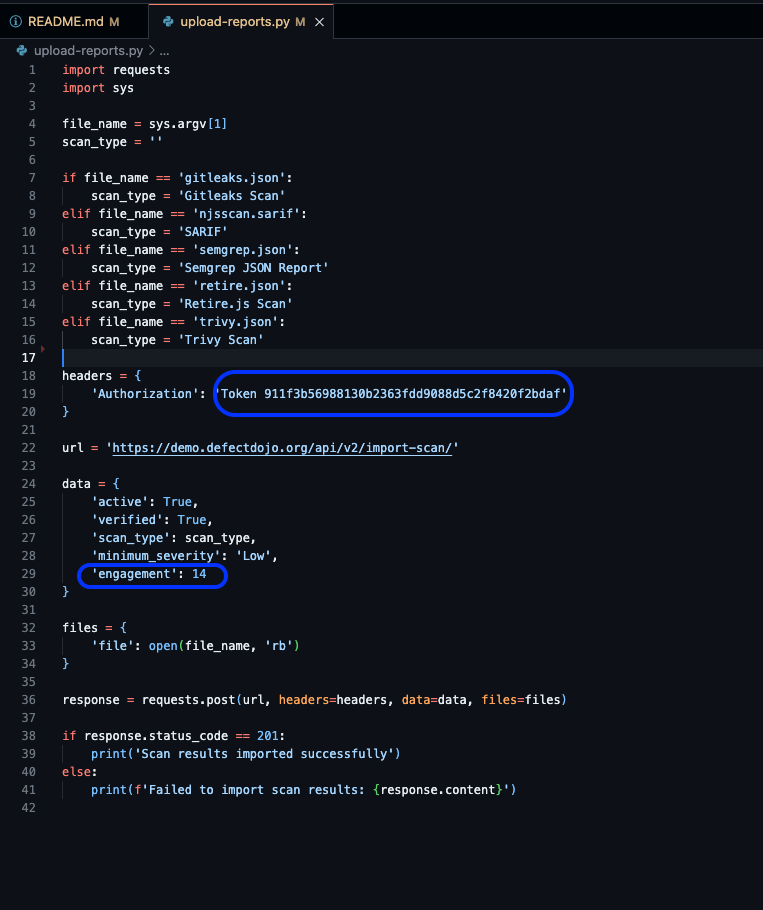
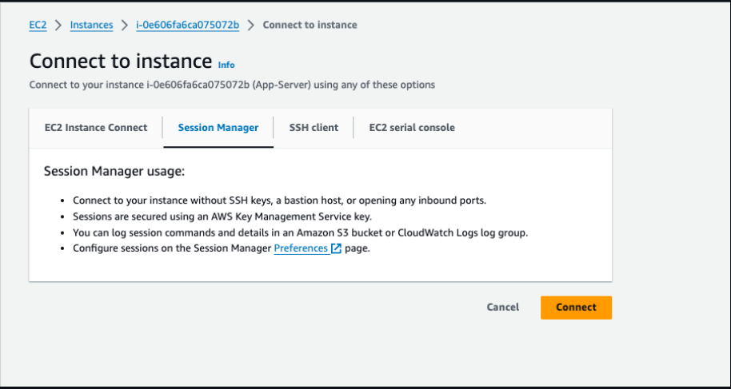
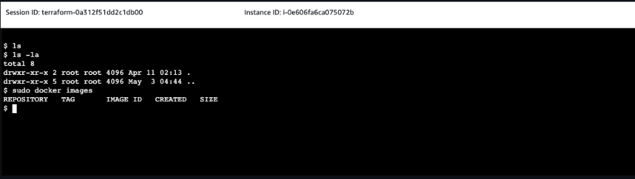
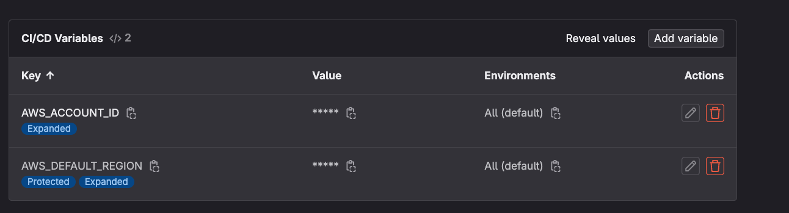

## (Currently still working on the documentation)

What is DevSecOps?

DevSecOps stands for Development, Security, and Operations. It is an approach that integrates security practices into the DevOps process, ensuring that security is considered at every stage of the software development lifecycle (SDLC). The goal is to build a culture of shared responsibility for security among all participants in the development and operations processes.

The idea is to provide layered security, such that if attackers gain access to some part of the system they should not get access to your whole system i.e. reducing the blast surface. They include:

- Access Management
- Network security
- Application security
- Logging
- Monitoring

This project will be focused on CICD part of software development and embed security checks in our pipelines. The tools used for the projects are:

- CI: Gitlab-CI
- Secret Scanning: Gitleaks
- 

# Secret scanning
We will start scanning our application code for sensitive data, secrets, credentials etc. Different tools can be used to scan for sensitive data in our code. We will be using gitleaks to check any hardcoded data. 

We will start by installing the tool locally on our system and use pre-commit hook and ensure before we commit the code it flags off if there are any sensitive data in our code. The goals is to:

- Automatically run scan before code is pushed to remote Git repository
- Prevent any hard-coded secrets in the Git repository





The screenshot above shows that we have sensitive data in our code, as a result, you will not be able to commit the code as planned. We need to update this also in our pipeline


Check the documentation on how to use [gitleaks](https://github.com/gitleaks/gitleaks) properly


We can see the pipeline failed


<!--  -->

Looking at the result we got from the scan, we have some false postives. False positive is when a scanning tool incorrectly flags a security vulnerability. As a result we need to go over the scan results to be sure, the result we are getting in line with what we are expecting. 

We have a folder named test which contains some dummy sensitive data, which we used for our yarn_test. We will exempt it from the scan, thereby creating a ``.gitleaks.toml`` file and specifying the folder or path to avoid while scanning. If we run the pipeline again, you will see we now have 15 warnings compare to 46 earlier.





# Static Code Security Testing (White Box Testing)
- Static code analysis (app is not running)
- Identifies security vulnerabilities in app’s source code, configuration files etc.
- Looks for common coding errors, deviations from secure coding practices etc.
- Can provide precise information about the security flaws. Also helpful for addressing issues related to code quality and design flaws.
- its linmitation does not capture vulnerabilities that only surface when interacting with the application (will be addressed in DAST)

In identifying vulnerabilities in source code, there is a need to use multiple tools to achieve an overall  view of vulnerabilities. we will be using [njsscan](https://hub.docker.com/r/opensecurity/njsscan) and [Semgrep](https://semgrep.dev/docs/semgrep-ci/sample-ci-configs#gitlab-cicd) respectively to do that


The result of the njsscan is showing one vulnerability and indicating success when we have the severity showing warning, we need to adjust the code


Semgrep scan is showing close to 23 vulnerabilities


Updating njsscan script ```njsscan --exit-warning . ``` to ensure it fails. Now we have showing exit code 1


# Software Composition Analysis
- Check third-party and open-source libraries and frameworks
- SCA tool goes through the dependencies of your application and checks whether any known vulnerabilities for that dependency and the specific version you use

We will be using ```retire.js```  to scan for all the dependencies and libraries in our code, to ensure there are no vulnerabilities in them. We will add another job to do SCA to scan codes of libraries in the node_modules folder where our dependencies are.


From the screenshots above, we can see all the vulnerabilities.

# OPA (Open Policy Agent) Conftest
- The Open Policy Agent is an open source, general purpose policy engine that unifies policy enforcement across the stack.
- Using Conftest you can write tests for kubernetes Configuration, dockerfile, terraform code etc.
- Conftest uses the Rego language from Open Policy Agent for writing the assertion

Before we build our image, we need to ensure our dockerfile follow best practice when creating an image such as:
- Avoid using latest images
- Run as a Non-Root User etc.

We will use OPA Confest to run a static test on our dockerfile using Rego language from Open Policy Agent to confirm. We create a file called opa-docker-rego-security.rego and specified all the conditions we want our dockerfile to meet


Running this rules against our Dockerfile


We will update our pipeline with OPA Conftest  


The result we got states we are using latest image and running the container as a root user, which are the conditions we specified in the policy.


Now lets update the Dockerfile 


# Image Scanning (Trivy)
We will use a tool called [trivy](https://aquasecurity.github.io/trivy/v0.52/) for scan our images
- Scan every image layer for known vulnerabilities
- Scan files inside container images for vulnerabilities, exposed Secrets, misconfigurations
- Scans for known vulnerabilities (CVEs)
- Scans vulnerabilities in the application dependencies

Next, we need to build our image and scan them. 


From the screenshot above, we can see all the vulnerabilities in our images.

# Vulnerability Management (DefectDojo)
- Centrally manage vulnerability findings of different tool
- Triage vulnerabilities and push findings to other systems
- Enriches and refines vulnerability data

Now that we have done some tests, we should be able to upload all the results from the various scan to a centralised platform, where we can audit each vulnerability. This leads us to [Defectdojo](https://documentation.defectdojo.com/) which will be used to visualize all our scan results. Now we need to update our code to update results from each tool. We are updating the script to use a particular output format to save the result with a given name and save it as an artifact (which can be referenced in the pipeline) with a given name.


Making use of defectdojo demo server ```demo.defectdojo.org ``` . The credentials are ``` admin / 1Defectdojo@demo#appsec ```.

Now, lets setup DefectDojo to upload our scan results


Click on the product type "DevSecOps"


<!--  -->


<!--  -->


# Automate Uploading Security Scan Results

<!-- Now lets write a python code to upload the results. 

 -->


<!--  -->


We will use python code to upload results on defectdojo
- Get Token


- Click on Generate New Key


We have our python code ```upload-reports.py```consisting of the API KEY token and updating the engagement value to 14 in the data field




<!--  -->

Update the pipeline to upload scan reports


<!-- 

 -->


Now we have uploaded all our scan results on DefectDojo


Now, we can easily audit all the vulnerabilities and have a very good understanding on common ones you are faced with and address ways of minimizing it.

# Provision Server (App-Server & Gitlab-Runner)

Next, we will deploy the application on a server (App-Server) to run DAST and also provision a server (Gitlab-Runner) to have our Self-managed Gitlab runner to run our work loads. The idea of running your pipeline workloads on a dedicated Gitlab runner is to allows for better control over security policies and compliance with internal security requirements. You can ensure that sensitive data and credentials are handled securely.


Gitlab runner instance


Set-up Gitlab-runner on our Gitlab-CI repo


Click on New Project Runner


In the tags section, specify ec2, shell. Which will be what we use to reference the runner when we want to use it in the pipeline.


SSH into Gitlab-runner server to run the [installation commands](https://docs.gitlab.com/runner/install/linux-repository.html) . Copy the following command below on the Gitlab-Runner server.

```
curl -L "https://packages.gitlab.com/install/repositories/runner/gitlab-runner/script.deb.sh" | sudo bash
sudo apt-get install gitlab-runner
```

```
sudo apt update
sudo apt  install awscli -y
sudo apt  install docker.io -y
sudo usermod -aG docker ubuntu
sudo usermod -aG docker gitlab-runner
```


Now we have setup our gitlab runner to handle workloads of our pipeline.


We can install trivy also on the Gitlab-Runner server to run the trivy pipeline stage. Restart the server and lets install trivy on it to do some heavy lifting for us.

```
sudo apt-get install wget apt-transport-https gnupg lsb-release
wget -qO - https://aquasecurity.github.io/trivy-repo/deb/public.key | sudo apt-key add -
echo deb https://aquasecurity.github.io/trivy-repo/deb $(lsb_release -sc) main | sudo tee -a /etc/apt/sources.list.d/trivy.list
sudo apt-get update
sudo apt-get install trivy
```

# Secure access to our servers (AWS SSM)
To secure access to our servers (App-server & Gitlab-runner server), we need to close SSH port. To connect to our instances securely we will be using using AWS system manager to provide a safe and secure access to our servers. 

Connect to the Gitlab-Runner server via SSH for now and run the following command ``` sudo systemctl status snap.amazon-ssm-agent.amazon-ssm-agent.service ``` to confirm if we have amazon-ssm-agent running on the server, which it is.


Attach SSM Role to the servers, so that the servers will be allowed to be managed by SSM.

Create Role for both Gitlab-Runner and App-Server instances. Below is Gitlab-runner setup (create role for App-Server also)


Attach AmazonSSMFullAccess and AmazonEC2ContainerRegistryFullAccess policy


Attach the role to the Gitlab-Runner server


Perform the same for App-server. Moving forward we should remove port 22 from both servers.


Now lets connect to the Gitlab-Runner via session-manager.





# Dynamic Application Security Testing (Black Box Testing)
- Testing the app’s running instance or deployed version
- Simulating security attacks and analyzing behavior and responses in real-time
- Does not require access to the code


<!-- 

 -->


Update the necessary variables for the CICD pipeline



